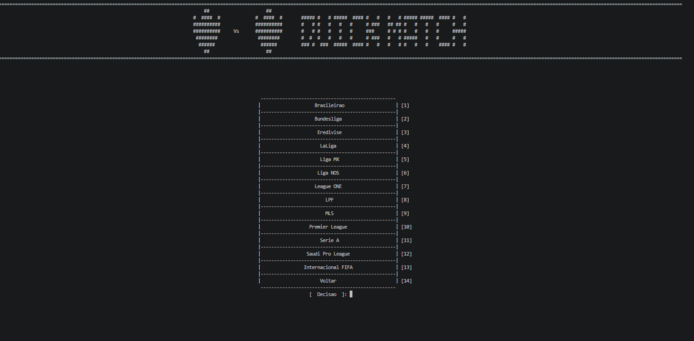
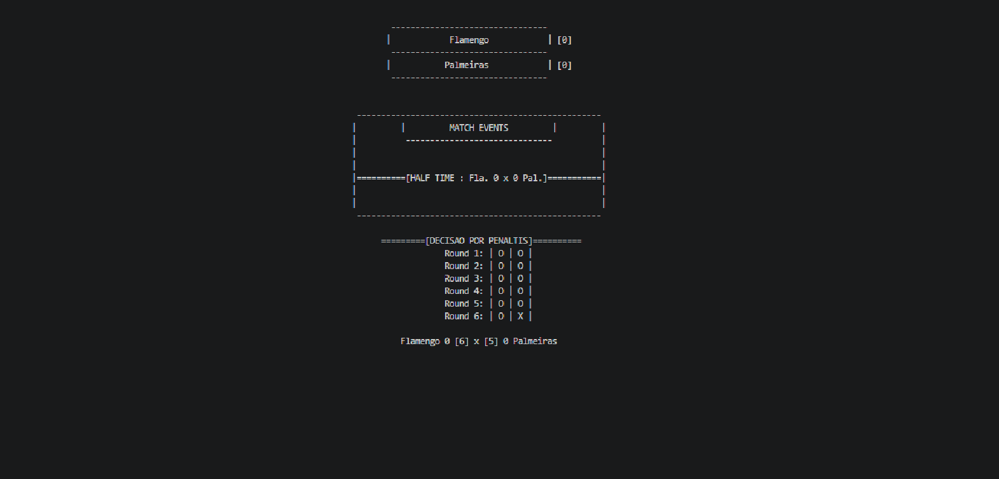
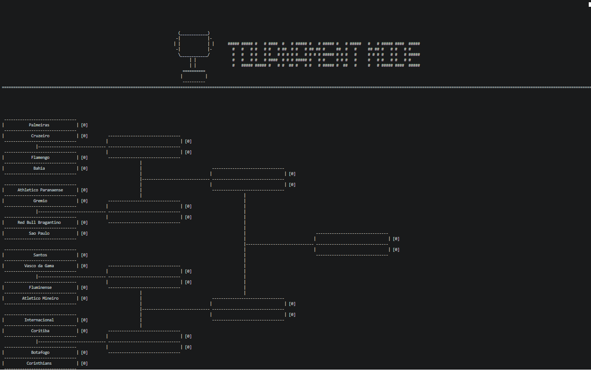

<h1 align="center">BRS 26</h1>

- Este é meu primeiro "Jogo", o tema dele é futebol e roda usando artes ASCII no terminal do Visual Studio Code (VSCode), eu evitei totalmente o uso de IA em momentos que requeriam lógica de programação para treinar questões de simulação tipicas de fase 2 OBI (por isso na main foi 100% eu) e para fazer artes ASCII a mão, já no database.cpp (o database.h eu fiz também) eu fiz apenas os brasileirao e os comentarios para não me perder na geração de ID's, era uma tarefa repetitiva que um bot pode me arrumar na internet em segundos. 

<h4>Disponivel já na V 1.5:</h4>

- Modo Simulação Rapida.

- Modo Torneio.

- Modo Liga.

- Configurações Globais.

 
<h2 align="center">Gameplay</h2>
 
<h3 align="center">Ligas (Apenas 1º Divisão)</h3>

    

- Todas as ligas + Seleções do nosso jogo!.

 
<h3 align="center">Gameplay de Simulação com Penaltis</h3>

    

- Tentei simular os fenomenos de uma partida e a decisao de penaltis vendo penalti a penalti.

 
<h3 align="center">Chaveamento (Talvez o Principal)</h3>

    

- Criei uma especie de "Algoritimo de Geometria" usando ASCII pois isso faz automaticamente todos os chaveamentos de 2 ao maior que a tela aguentar. Tranquilamente a parte mais demorada do algoritimo inteiro.

<h3 align="center">Menu Inicial</h3>

    

